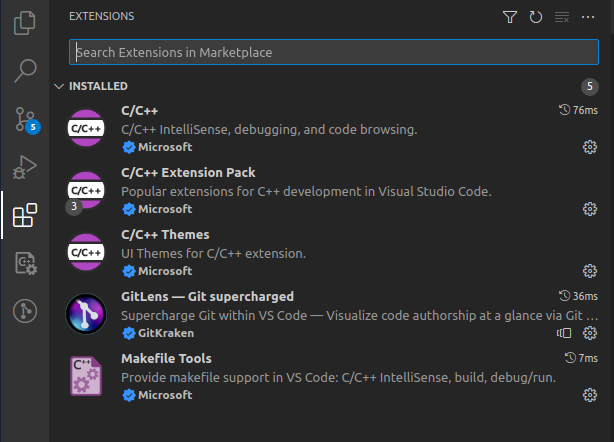
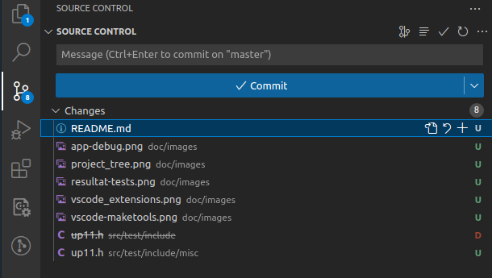
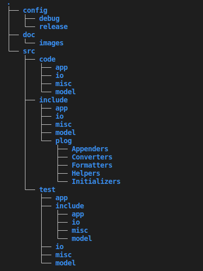
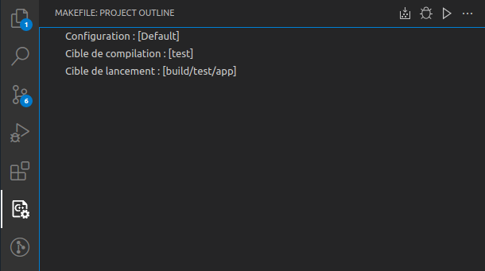
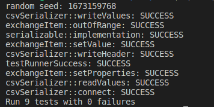

# Template d'application C++ pour le cadre de la formation AJC

## Role

Le but de ce template est de fournir un exemple d'application qui ressemble plus à une application de production qu'un simple `Hello World` et qui montre également des classiques d'infrastructure qu'on rencontre dans la vraie vie.

Ce document aborde les thématiques suivantes:

- Utilisation de VS Code
- Architecture modulaire d'une application
- Makefile
- Testing
- Logging
- Configuration en fonction du type de build

## Avant de commencer - VS Code

Ce projet ne nécessite pas VS Code mais je vous recommande fortement son utilisation car les extensions liées au c++, à Makefile et à git, permettent d'être beaucoup plus rapide. Si vous travaillez en groupe c'est bien d'utiliser un editeur commun pour pouvoir vous aider plus facilement et avoir les mêmes comportement.

Voici quelques instructions pour l'installer ainsi que les extensions qui seront présentées dans ce document.

1. Installation: `apt install code`

2. Ajout des extensions: avec `C/C++ Extension Pack`, `GitLens` et `Makefile Tools` on a tout ce qu'il faut



Le bouton qui permet d'installer les extensions apparaît en blanc sur la capture ci-dessus et il ne reste qu'à taper les noms des extensions à installer.

3. Git est très bien intégré à Vs Code:



Le bouton de gestion de Git apparaît en blanc dans la capture ci-dessus: Combiner avec l'extension GitLens on peut faire absolument tout ce qu'on veut de manière graphique.

## Contenu du projet

Si on regarde le fichier `src/code/main.cpp` on voit qu'il instancie un objet app , lance la fonction `init` de cet objet et si elle fonctionne appelle la méthode `run` de l'objet. Le code main devrait toujours être comme ça et une application devrait toujours avoir une méthode init et un méthode run (peu import le nom, bien sûr). En effet, il faut pratiquement toujours initialisers différents composants, avant d'exécuter la tache. Cette application ne fait pas beaucoup plus qu'un hello world, elle indique seulement chaque étape, (initialisation, exécution, fermeture, nettoyage) qui rappelle le cycle de vie qu'on retrouve toujours dans une application. Elle génère également une grosse exception pour rappeler qu'en l'état elle ne sert à rien et que tout reste à faire.

Le projet contient aussi une petite implémentation d'un serialiseur CSV qui permet de faciliter la lecture et l'écriture d'objets c++ décrits dans des csv. Les classes sont uniquement utilisées par mon application de test pour montrer comment tester ce qu'on code dans les règles de l'art.

## Architecture modulaire

Jusqu'à présent dans les cours AJC, les fichiers de codes et les headers étaient sont créés dans un seul dossier. Des qu'on dépasse 5 ou 6 classes, on se retrouve avec une grande liste de fichiers et on s'y perd. Une architecture modulaire permet de séparer logiquement les fichiers. Dans cet example nous avons l'infrastructure suivante:



Ça peut parraître beaucoup, surtout si on compare à un seule dossier pour tout, mais pour un vrai projet c'est un peu le minimum. On remarque:

- Le dossier src qui contient les sous-dossiers
    - code : le code de l'application (fichiers .cpp)
    - include : les headers (fichiers .hpp)
    - test : le code et les headers des tests
- Quatre dossiers appraissent un peu partout qui représentent quatre modules:
    - app : contient le code de l'application principale
    - io : pour les opérations de lecture/écriture (fichier, BDD, ...)
    - misc : le code utilitaire qui est généralement partagé par les autres
    - model : c'est ici qu'on met les objets que l'application manipule (Universite, Personne, Contact,...)

Le nombre et le nom des modules a été choisi de façon arbitraire mais il est souvent plus facile de distinguer l'application qui gère les différentes tâches du programmes, les besoin de lire et écrire des données, les modèles, et enfin les utilitaires. Dans un vrai projets ces dossiers finissent par contenir d'autres dossiers au fur et à mesure que le projet grandit.

Les modules sont utilisés pour les tests, les headers et le code de façon à pouvoir s'y retrouver plus facilement.

Le dossier doc contient les ressources de ce document, et le dossier config permet de stocker des fichiers de config spécifique à chaque build

## Makefile

Il existe différentes façon de configure VS Code pour compiler son code, mais l'extension `Make Tools` va permettre de passer très rapidement d'un build de test à un build debug ou un build de production. L'extension ajoute un bouton spécifique dans le menu de gauche qui permet de configurer le build choisi.



Le bouton Make Tools apparaît en blanc sur la capture d'écran ci-dessous. Son interface minimaliste permet de sélectionner les différentes cibles du makefile, de compiler, débuger ou lancer une application.

La partie qui m'a demandé la plus de temps a été la création du Makefile (je ne connaissais vraiment pas bien).
Je l'ai commenté au maximum, mais si vous avez envie d'y toucher un minimum il ne faut se concentrer que sur la première ligne:

```
# Si la structure des modules change dans le projet changer MODULES en conséquence
MODULES 	:= app io misc model
```

Si vous changez le nom de vos modules, il faut changer cette ligne en fonction: il est important également d'avoir des noms semblables pour les includes et les tests, car cette variable permet de générer différents les includes et la génération de fichiers .o par module et par type de compilation.

Autre élément important: il est nécessaire que l'application contenant la méthode main soit en dehors des modules (main.cpp, test.main.cpp): on ne peut compiler qu'avec une seule fonction main.

Il y a trois cibles en plus de clean et mrproper:

- debug: compile l'application avec les infos de debug dans le dossier build/debug. Les .o sont dans obj/debug/
- release: compile l'application avec les infos de release dans le dossier build/release. Les .o sont dans obj/release/
- test: compile l'application de test ainsi que tout le code source en mode debug sauf l'application principale

En compilant avec debug ou release on produit l'application, et en compilant avec test on produit l'application de test.

**Remarque:** [CMake](https://cmake.org/) apparaît être une solution mieux adaptée aux projets de la vraie vie. La courbe d'apprentissage étant plus élevée, on se contente dans le cadre de la formation de Makefile qui permet quelques automatisations intéressantes.

## Testing

Avant de lancer et compiler l'applcation vérifions que tout fonctionne bien. On peut compiler depuis le dossier racine dans le terminal avec la commande `make test`, mais il vaut mieux utiliser l'interface de `Make Tools` en éditant la `Cible de compliation` et en sélectionnant `test` dans la liste des choix proposés. En haut à droite de l'interface, le bouton le plus à gauche permet de compiler. Si tout c'est bien passé on peut maintenant éditer la `Cible de lancement` en sélectionnant `build/test/app` dans la liste proposée. Maintenant on peut lancer l'application avec le triangle (bouton le plus à droite) et on devrait voir ceci:



L'application peut être lancée avec `./build/test/app` depuis la racine du projet.

Ces tests sont mis en œuvre à l'aide d'une [petite librairie](https://github.com/DronMDF/upp11) très pratique (un simple fichier header): Une utilisation habile des commandes préprocesseurs permet d'écrire très rapidement des tests.

Le code source de tests est développé indépendamment de l'application, on peut y rajouter des exemples, des classes de tests sans polluer l'application. La compilation en mode debug et release n'utilisera aucune librairie du projet de test.

On conserve la modularité en gardant les même noms de dossier et on reprend les noms de classes testées en rajoutant .test juste pour mieux s'y retrouver. Normalement, il devrait y avoir autant de fichier de tests que de fichier de code créés, chaque fichier testant le code source d'une seule classe, encore une fois pour éviter de s'y perdre et de pouvoir facilement qu'est-ce qu'on a testé ou pas dans l'application.

Je vous laisse regardé quelques fichiers de tests pour comprendre comment ça marche, en faisant notamment des tests pour un `CSVSerializer` qui utilise un `ExchanteItem` et une interface `Serializable` pour ne plus avoir à s'occuper que du parsing entre l'objet d'échange et un modèle quelconque.

## Logging

Changeons de cible avec `Make Tools` pour en sélectionnant la `Cible de compilation` nommé `debug`. On peut maintenant sélectionner la `Cible de lancement` nommée `build/debug/app` (oui je sais ça aurait été chouette que ça change automatiquement, mais j'ai pas trouvé d'instinct...). Le lancement de l'application devrait donnée ceci:


Pas de panique, le système n'a pas planté, le gros message est juste une démo de l'api de loggin intégrée au projet.
Jusqu'ici on a fait toutes nos sorties consoles avec cout, mais comme l'a dit Steeve on a pas toujours de sortie standard sous la main. Dans la vraie vie on utilise un outil de logging, qui permet de sortir du texte sur la console mais aussi dans des fichiers de logs. J'ai choisi d'utiliser [plog](https://github.com/SergiusTheBest/plog), librairie simple et portable (fichier header uniquement) qui permet de logger de façon syncrhone. Comme pour l'api de Testing, j'ai choisi un petit projet perso, conçu comme un utilitaire. Dans la vraie vie, on utiliserait des outils plus pointus et plus complexes, mais ce genre d'api est parfaite pour un projet d'apprentissage: pas tropp complexe à aborder, et permet de se familiariser avec les concepts utilisés par les plus grosses librairies (comme celles de [Boost](https://www.boost.org/) par exemple, qui possède une librairie de logging et de testing).

avec `PLOG` la seule chose qui change c'est qu'au lieu d'écrire cout on écrit:

- PLOGI ou PLOG_INFO afin d'afficher exactement la même chose qu'avec cout (sauf que le retour à la ligne est automatique);
- PLGOD ou PLOG_DEBUG pour afficher un message de debug: très utile pour comprendre ce qui ne va pas sur une application déployée
- PLOGW ou PLOG_WARNING: quand on veut afficher un avertissement
- PLOGE ou PLOG_ERROR: quand on veut signaler une erreur gérée (l'utilisateur s'est planté, mais l'appli tient bon)
- PLOGF ou PLOG_FATAL: quand on veut afficher une erreur critique qui fait  planter l'appli
- PLOGV ou PLOG_VERBOSE : quand on veut tracer tout ce qu'on fait et produire plein de logs

En plus d'être affichés dans la console les messages sont également tracés dans un fichier `app.log` dont la taille est limitée (voir la doc pour plus d'info). J'ai customisé les sortie de façon à afficher pour les erreurs critiques et pour le debug:

- Le nom du fichier ou le log a été généré
- La méthode ou le log a été généré
- Le numéro de ligne ou le log a été génré

Ces infos sont bien utiles en cas de problème lorsque l'application est déployée pour retrouver ou ça a foiré.

Un des grands avantages des logs c'est qu'on peut paramétrer un filtre de sortie: on peut dire que tous les logs dont la sévérité est inférieure à un certain nombre ne seront pas écrits (le code n'est pas traité).

L'odre des sévérité est le suivant: 1-Fatal, 2-Error, 3-Warning, 4-Info, 5-Debug, 6-Verbose.
L'application configure le logeur avec le premier argument passé à l'application.
Si on lance l'application avec la commande `./build/test/app info` par exemple seules les messages dont la sévérité est inférieure ou égale à info sont affichés.

J'ai mis en place un mécanisme (décrit plus bas) qui fait que l'application compilée en debug se lance par défaut avec le filtre debug, alors que l'application compilée en release se lance par défaut avec le filtre info. Cette astuce permet de ne pas se soucier d'effacer le code de debug, puisqu'il sera masqué par défaut par l'application. Par contre si quelque chose se passe mal on peut toujours forcer l'affichage des messages de debug pour comprendre ce qu'il se passe.

## Configuration en fonction du type de build

Il est très courant (je dirais même que ça arrive tout le temps) que l'on souhaite des comportements différents pour une application lorsque est elle en compilée en développement (debug) et en production (release). On peut utiliser des directives préprocesseurs, avant de compiler, mais on risque d'oublier et on souhaite un traitement automatique.

Une approche, courante mise en oeuvre ici est d'utiliser un fichier de configuration qui est duppliqué dans deux dossier différents (au hasard, debug et release, par exemple): les deux fichiers ont le même noms et définissent les mêmes propriétés mais avec des valeurs différentes. Dans ce template, le dossiers config/debug et config/ contiennent un fichier config.h qui définit le filtre de sévérité par défaut pour l'outil de logging.

À l'aide du Makefile l'un ou l'autre des fichiers est choisi à la compilation et le tour est joué.

J'ai utilisé ici un fichier header, mais souvent ce sont des fichiers .json qui sont chargés au lancement de l'application.

## Conclusion

Ce petit projet me semble être une bonne architecture de départ pour le projet final. C'est certes un peu plus complexe que les projets vus jusqu'à présent, mais la séparation des tests, l'utilisation des logs, et l'infrastructure modulaire devraient vous faire gagner du temps. Ne soyez pas inquiets, si l'implémentation des api de logging ou de tests sont complexes à comprendre, l'important c'est que leur usage est assez simple à assimiler et vous met sur la voie de projets réels.

Quelques petits conseils pour le projeet final (synthèse des problèmes remontés):

- Travaillez sur un environnement commun (OS, Editeur de code), quitte à utiliser des VMs, vous perdrez moins de temps
- Confiez la gestion de Gitlab au développeur le plus expérimenté, passer une journée à comprendre comment utiliser Git et tâchez de respecter ces règles d'or pour éviter des problèmes:
    - On commence toujours par faire un pull de la branche principale issue du cloud
    - Si on n'arrive pas à faire le pull (un le matin, un l'après midi), on ne fait pas de copier/coller sauvage, il faut éviter de corrompre les logs
    - Répartissez vous les tâches afin de ne jamais travailler à plusieurs sur le même fichier, une même classe peut être implémentée sur plusieurs fichiers différents, c'est mieux que de passer son temps à régler des conflits
    - Ne modifiez jamais le code de quelqu'un sans lui en avoir parlé d'abord, encore du temps de perdu évité
    - Pas besoin de faire 50 commits par jour, un en fin de matinée et un en fin de journée suffisent
    - Avant de faire un commit (et surtout un push), lancez un build de test et faites le tourner: il ne faut jamais pousser du code non fonctionnel et les seules erreurs de tests acceptées doivent être des fonctions non implémentées
- Passez du temps sur l'architecture de votre projet, et la création de tests: le temps perdu au démarrage sera largement compensé en deuxième semaine.


Je vous souhaite à tous bonne chance pour le projet, n'oubliez pas que le voyage est souvent plus important que la destination.


